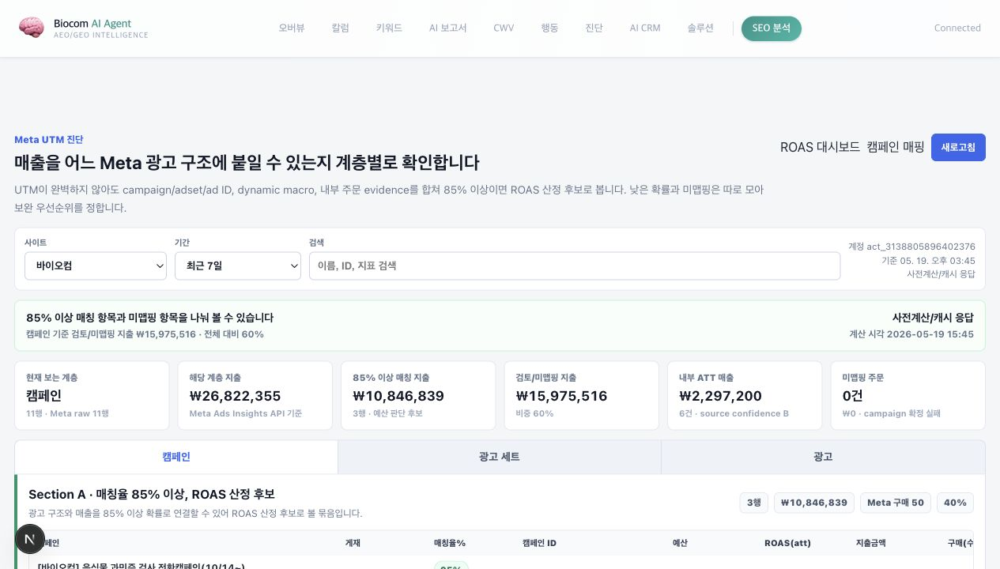
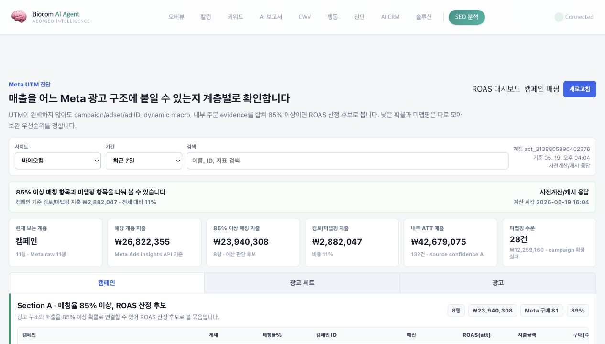
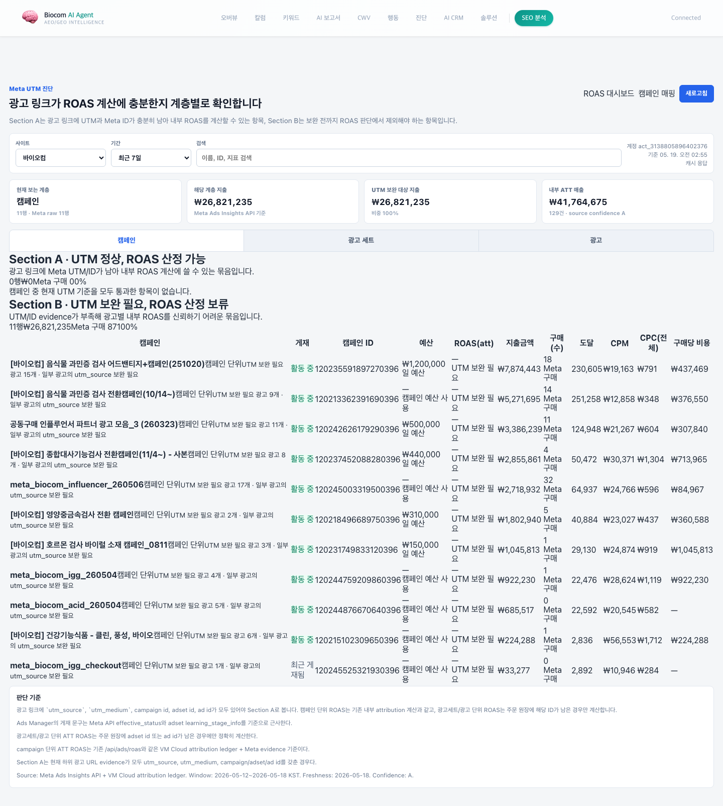
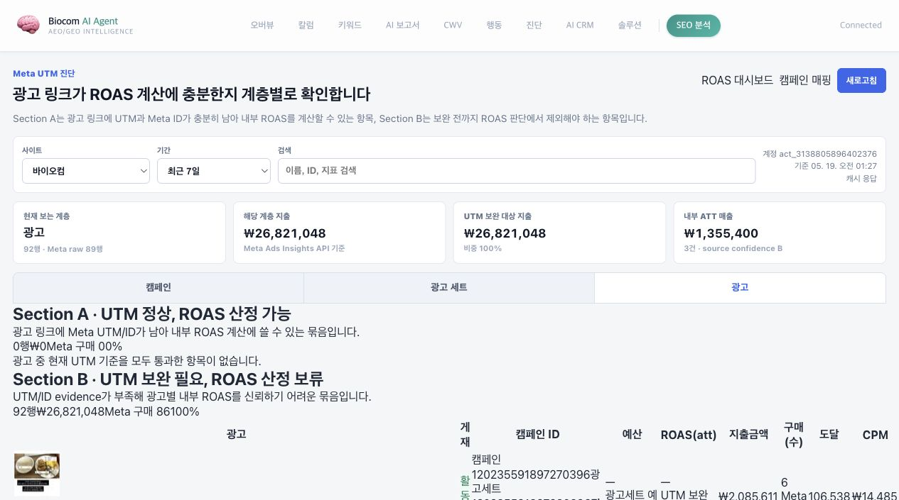

# Meta UTM 진단 프론트엔드 확인 컨펌

작성 시각: 2026-05-19 01:50 KST
기준일: 2026-05-19
문서 성격: 프론트엔드 화면 확인용 컨펌 / 운영 배포 결과 포함
대상 화면: `/ads/meta-utm`
Lane: Green local development + Yellow scoped 운영 배포 승인 완료

```yaml
harness_preflight:
  common_harness_read:
    - AGENTS.md
    - CLAUDE.md
    - docurule.md
    - frontrule.md
    - harness/common/HARNESS_GUIDELINES.md
    - harness/common/AUTONOMY_POLICY.md
    - harness/common/REPORTING_TEMPLATE.md
  project_harness_read:
    - data/!data_inventory.md
    - gdn/attribution-data-source-decision-guide-20260511.md
    - meta/meta-utm-diagnostics-frontend-20260519.md
  lane: Yellow scoped frontend/backend deployment approved and completed
  allowed_actions:
    - local_frontend_implementation
    - local_backend_read_only_api
    - local_browser_smoke
    - screenshot_capture
    - confirmation_documentation
    - scoped_frontend_backend_deploy_after_TJ_approval
    - pm2_restart_after_TJ_approval
    - production_smoke_read_only
    - scoped_commit
  forbidden_actions:
    - Meta_platform_mutation
    - GTM_publish
    - operating_db_write
    - VM_Cloud_ledger_write
    - platform_conversion_send
  source_window_freshness_confidence:
    source: "Meta Graph API + VM Cloud attribution ledger via local backend read-only API"
    window: "2026-05-12 ~ 2026-05-18 KST, biocom, act_3138805896402376"
    freshness: "local API cache 2026-05-19 15:45 KST, production API cache 2026-05-19 16:04 KST"
    confidence: "A for production source read, high for frontend rendering"
```

## 10초 요약

Meta 광고 링크가 내부 ROAS 계산에 충분한지 캠페인, 광고 세트, 광고 계층별로 확인하는 화면을 만들었다.

현재 바이오컴 최근 7일 기준으로는 광고 지출이 잡힌 항목이 모두 `Section B · UTM 보완 필요`에 들어간다. 이는 화면 오류가 아니라 현재 광고 URL evidence에 `utm_source`, `utm_medium`, campaign/adset/ad ID가 충분히 남지 않는다는 진단 결과다.

2026-05-19 02:54 KST 기준 운영 배포까지 완료했다. TJ님이 확인할 것은 `https://biocom.ainativeos.net/ads/meta-utm` 운영 화면에서 캠페인/광고세트/광고 계층 전환, Section A/B 판단, 광고 썸네일과 게재 상태/ID/성과 지표가 의사결정에 충분한지다.

2026-05-19 15:47 KST 추가 개발로 판단 기준을 `UTM 완전성`에서 `85% 이상 광고 구조 매칭 가능성`으로 바꿨다. 이제 각 행에 `매칭율%`가 보이고, 85% 이상은 Section A, 1~84%는 Section B, 0%는 Section C 미맵핑으로 따로 모인다. 미맵핑 주문 묶음도 별도 카드로 표시한다.

2026-05-19 16:07 KST 기준 TJ님 배포 승인 후 운영 반영까지 완료했다. 운영 화면에서 `매칭율%`, Section C, 미맵핑 주문 카드가 보이고, API는 새 `match` 필드를 반환한다.

## 2026-05-19 15:47 추가 변경

목적:

- TJ님 요청대로 UTM이 조금 부족해도 “이 광고/광고세트/캠페인일 가능성이 85% 이상인가”를 먼저 보게 했다.
- 매칭이 낮거나 없는 항목은 예산 판단에 섞이지 않도록 별도 섹션으로 분리했다.

변경된 화면 기준:

| 구분 | 의미 | 예산 판단 |
|---|---|---|
| Section A | 매칭율 85% 이상 | ROAS 산정 후보 |
| Section B | 매칭율 1~84% | 보완/샘플 검토 후 판단 |
| Section C | 매칭율 0% | 미맵핑으로 별도 확인 |

로컬 검증 숫자:

- Source: Meta Ads Insights API + VM Cloud attribution ledger read-only.
- Window: 2026-05-12 ~ 2026-05-18 KST.
- Site: biocom.
- Account: `act_3138805896402376`.
- Freshness: local live cache miss 2026-05-19 15:45 KST, 직후 브라우저 조회 cache hit 0.003초.
- Confidence: source confidence B.
- 전체 row: 134개.
- Section A: 60개.
- Section B: 13개.
- Section C: 61개.
- 미맵핑 주문: 0건 / ₩0.

저장한 화면:



파일:

- `confirm/meta-utm-match-rate-local-20260519.png` — 매칭율% 열과 Section A/B/C가 보이는 로컬 화면 캡처.

검증:

- Backend typecheck: `npm run typecheck` 통과.
- Frontend build: `npm run build` 통과.
- Frontend targeted lint: `npx eslint src/app/ads/meta-utm/page.tsx` 통과, 기존 광고 썸네일 `` 경고 1개만 남음.
- Local API smoke: `GET /api/ads/meta-utm-diagnostics?account_id=act_3138805896402376&date_preset=last_7d` 200.
- Browser smoke: `매칭율%`, `Section C · 미맵핑`, `미맵핑 주문` 노출 확인.

운영 배포 결과:

- 배포 승인: TJ님, 2026-05-19 KST.
- 배포 시각: 2026-05-19 16:01~16:04 KST.
- 배포 커밋: `1a1dc0c growth-data: add meta utm match confidence`.
- Remote backup: `/home/biocomkr_sns/seo/repo/.deploy-backups/meta-utm-match-20260519T155912KSTn`.
- Backend PM2: `seo-backend` restart `4277 -> 4278`, 4분 관찰 후 추가 증가 없음, memory 약 243MB.
- Frontend PM2: `seo-frontend` restart `56 -> 57`, 4분 관찰 후 추가 증가 없음, memory 약 169MB.
- Cloudflared PM2: restart `1`, 변경 없음.
- Frontend page: `https://biocom.ainativeos.net/ads/meta-utm` 200 / 약 0.43초.
- Backend health: `https://att.ainativeos.net/health` 200 / 약 0.90초.
- Meta UTM API cache hit: 200 / 약 0.45초.
- CORS: `Access-Control-Allow-Origin: https://biocom.ainativeos.net` 확인.
- Browser smoke: `매칭율%`, `Section C · 미맵핑`, `미맵핑 주문` 표시 확인.
- Browser console: error/warning 0건.

운영 API 숫자:

- Source: Meta Ads Insights API + VM Cloud attribution ledger read-only.
- Window: 2026-05-12 ~ 2026-05-18 KST.
- Site: biocom.
- Account: `act_3138805896402376`.
- Freshness: 운영 API cache 2026-05-19 16:04 KST.
- Confidence: source confidence A.
- 전체 row: 134개.
- Section A: 70개.
- Section B: 6개.
- Section C: 58개.
- 미맵핑 주문: 28건 / ₩12,259,160.

운영 캡처:



파일:

- `confirm/meta-utm-match-rate-prod-deploy-20260519.png` — 운영 URL 기준 매칭율 화면 캡처.

하지 않은 것:

- 운영DB write, VM Cloud ledger write, Meta 플랫폼 mutation은 하지 않았다.
- GTM publish, conversion send, Imweb footer 변경은 하지 않았다.

## 운영 배포 결과

배포 시각: 2026-05-19 02:54 KST  
배포 코드 커밋: `12d845b growth-data: add meta utm diagnostics and leading indicators`  
배포 대상:

- Frontend: `https://biocom.ainativeos.net/ads/meta-utm`
- Backend: `https://att.ainativeos.net/api/ads/meta-utm-diagnostics`

운영 검증:

| 항목 | 결과 | 기준 |
|---|---|---|
| Frontend page | 200 / 0.377s | `https://biocom.ainativeos.net/ads/meta-utm` |
| Backend health | 200 / 0.303s | `https://att.ainativeos.net/health` |
| Meta UTM API cold miss | 200 / 35.691s | 첫 live cache miss |
| Meta UTM API cache hit | 200 / 0.408s | 직후 lazy cache hit |
| CORS | PASS | `Access-Control-Allow-Origin: https://biocom.ainativeos.net` |
| Browser runtime | PASS | Playwright 기준 console error 0건, failed request 0건 |
| PM2 backend | online | restart count `4271 -> 4272` |
| PM2 frontend | online | restart count `53 -> 54` |

운영 API 응답 기준 숫자:

- Source: Meta Ads Insights API + VM Cloud attribution ledger read-only.
- Window: 2026-05-12 ~ 2026-05-18 KST.
- Site: biocom.
- Account: `act_3138805896402376`.
- Freshness: API cache 2026-05-19 02:55 KST, next refresh 2026-05-19 03:10 KST.
- Confidence: source confidence A.
- 현재 캠페인 계층 화면: 11행, 지출 ₩26,821,235, 내부 ATT 매출 ₩41,764,675, 내부 ATT 주문 129건.
- 전체 진단 row: 134행. Section A 0행, Section B 134행.

운영 캡처:



파일:

- `confirm/meta-utm-prod-deploy-20260519-0256.png` — 운영 URL 기준 Playwright 캡처.

## TJ님 컨펌 요청

### 확인할 화면

```text
https://biocom.ainativeos.net/ads/meta-utm
```

확인 기준:

1. 캠페인 / 광고 세트 / 광고 탭이 Meta 광고 관리자처럼 계층 전환으로 이해되는가.
2. `Section A · 매칭율 85% 이상`, `Section B · 1~84%`, `Section C · 미맵핑`이 예산 판단 기준으로 충분히 명확한가.
3. 광고 탭에서 썸네일, 광고 ID, 광고 세트 ID, 캠페인 ID가 한눈에 보이는가.
4. 요청한 성과 지표 열이 충분한가.
   - 캠페인/광고세트/광고 이름
   - 매칭율%
   - 게재
   - 캠페인 ID
   - 예산
   - ROAS(att)
   - 지출금액
   - 구매 수
   - 도달
   - CPM
   - CPC(전체)
   - 구매당 비용
5. 미맵핑 주문 `28건 / ₩12,259,160`이 예산 판단에서 따로 봐야 할 금액으로 이해되는가.

컨펌 문구 예시:

```text
[확인 완료] Meta UTM 매칭율 운영 화면 확인 완료.
85% 기준과 미맵핑 분리 방향을 유지해도 된다.
```

## 저장한 화면 캡처

확인용 PNG는 같은 `confirm/` 폴더에 저장했다.



파일:

- `confirm/meta-utm-confirm0519-1-ad-tab-viewport.png` — 화면 확인용 viewport 캡처.
- `confirm/meta-utm-confirm0519-1-ad-tab.png` — 전체 페이지 캡처.

## 구현 내용

### 프론트엔드

- 새 화면: `frontend/src/app/ads/meta-utm/page.tsx`
- 기존 ROAS 화면 연결: `frontend/src/app/ads/page.tsx`
- 표시 방식:
  - 캠페인 / 광고 세트 / 광고 3개 계층 탭.
  - Section A와 Section B 분리.
  - 광고 탭에서 썸네일, 광고 ID, 광고 세트 ID, 캠페인 ID 노출.
  - `활동 중`, `준비중`, `머신러닝 진행 중`, `광고 오류` 등 게재 상태 badge 표시.

### 백엔드

- 새 read-only API: `GET /api/ads/meta-utm-diagnostics`
- 입력:
  - `account_id`
  - `date_preset`
  - `since`, `until`
  - `site`
- 역할:
  - Meta Graph API에서 현재 캠페인, 광고 세트, 광고와 성과 지표를 읽는다.
  - VM Cloud attribution ledger 기반 ATT 매출/주문을 붙인다.
  - 광고 URL evidence에서 UTM/Meta ID 존재 여부를 판정한다.
  - 15분 lazy cache로 같은 요청을 빠르게 재사용한다.

## 실제 확인된 숫자

Source / window / freshness / confidence:

- Source: Meta Graph API + VM Cloud attribution ledger.
- Window: 2026-05-12 ~ 2026-05-18 KST.
- Site: biocom.
- Account: `act_3138805896402376`.
- Freshness: local API cache 2026-05-19 01:55 KST.
- Confidence: attribution 해석 B, 화면 렌더링 high.

계층별 local API 결과:

| 계층 | 표시 행 | Meta 지출 | Meta 구매 | 내부 ATT 매출 | 내부 ATT 주문 | 판정 |
|---|---:|---:|---:|---:|---:|---|
| 캠페인 | 11 | ₩26,821,153 | 87 | ₩5,135,700 | 11 | Section B |
| 광고 세트 | 31 | ₩26,821,153 | 87 | ₩6,032,100 | 13 | Section B |
| 광고 | 92 | ₩26,821,153 | 86 | ₩1,355,400 | 3 | Section B |

Raw Meta 객체:

- 캠페인 31개.
- 광고 세트 82개.
- 광고 1,004개.
- 성과 지표 row: campaign 11개, adset 28개, ad 89개.

## 검증 결과

통과:

- Backend typecheck: `npm run typecheck`.
- Frontend targeted lint: `npm run lint -- src/app/ads/meta-utm/page.tsx src/app/ads/page.tsx`.
- Frontend production build: `npm run build`.
- Harness preflight: `python3 scripts/harness-preflight-check.py --strict`.
- 문서 wiki link check: `python3 scripts/validate_wiki_links.py meta/meta-utm-diagnostics-frontend-20260519.md`.
- Browser smoke:
  - `/ads/meta-utm` 렌더링.
  - 캠페인 / 광고 세트 / 광고 탭 표시.
  - Section A/B 표시.
  - 광고 탭 썸네일 92개 표시.
  - 광고 ID / 광고 세트 ID 표시.

추가 API smoke:

- `GET /api/ads/meta-utm-diagnostics`: 200.
- Cold live miss: 37.52초까지 관측.
- 직후 lazy cache hit: 0.004초.

## 하지 않은 것

| 항목 | 상태 |
|---|---|
| 운영 프론트 배포 | 하지 않음 |
| VM Cloud 배포/restart | 하지 않음 |
| 운영DB write/import | 하지 않음 |
| VM Cloud ledger write | 하지 않음 |
| Meta 광고 설정 변경 | 하지 않음 |
| Meta CAPI/전환 send | 하지 않음 |
| GTM publish | 하지 않음 |

## 남은 리스크

1. Meta 광고 관리자와 게재 문구가 100% 동일하지 않을 수 있다.
   - 이유: API에서 내려오는 `effective_status`, `learning_stage_info` 기반으로 사람이 읽는 문구를 만든다.
2. 광고 세트/광고 단위 ATT ROAS는 현재 UTM/ID evidence가 부족하면 정확도가 낮다.
   - 대응: Section B로 분리해 예산 판단에서 보류한다.
3. 첫 live miss가 느릴 수 있다.
   - 대응: 현재 lazy cache hit는 빠르지만, 운영 배포 전 캐시 warm 또는 비동기 refresh 정책을 같이 점검한다.

## 다음 할일

### TJ님이 할 일

1. 프론트 화면을 보고 컨펌 여부를 결정한다.
   - 무엇: `http://localhost:7010/ads/meta-utm`에서 광고 탭과 Section A/B를 확인한다.
   - 왜: 운영 배포 전에 화면 구조가 실제 의사결정에 맞는지 확인해야 한다.
   - 성공 기준: 위 `TJ님 컨펌 요청` 체크리스트 5개가 OK다.
   - 실패 시 확인점: 부족한 열, 문구, 섹션 기준, 썸네일 크기, 게재 상태 표시 중 무엇이 문제인지 표시한다.
   - Codex가 대신 못 하는 이유: 화면이 실제 운영 판단에 충분한지는 TJ님 의사결정 기준이 필요하다.
   - 승인 필요 여부: 프론트 확인 컨펌 필요. 운영 배포 승인은 별도다.
   - 추천 점수/자신감: 92%.

### Codex가 할 일

1. TJ님 컨펌 후 운영 배포 승인안을 진행한다.
   - 무엇: `/ads/meta-utm` 프론트와 `/api/ads/meta-utm-diagnostics` 백엔드 API를 함께 운영에 반영하는 승인안을 만든다.
   - 왜: 프론트만 배포하거나 API만 배포하면 운영 화면이 깨질 수 있다.
   - 어떻게: 배포 전 build/typecheck 재확인, 운영 API 200 smoke, 운영 화면 캡처를 묶는다.
   - 성공 기준: `https://biocom.ainativeos.net/ads/meta-utm`에서 캠페인/광고세트/광고 탭과 Section A/B가 표시된다.
   - 실패 시 다음 확인점: Cloud route, CORS, Meta API token, backend log, frontend build 반영 여부.
   - 승인 필요 여부: 운영 배포는 Yellow Lane 승인 필요.
   - 의존성: TJ님 프론트 화면 컨펌.
   - 추천 점수/자신감: 90%.
