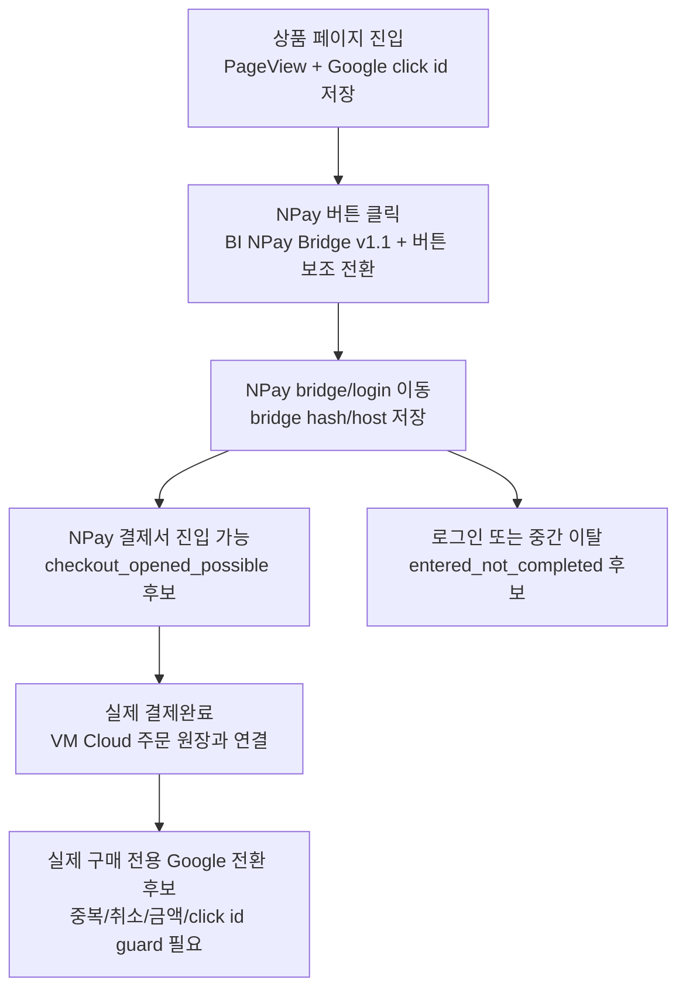

# Google NPay entered_not_completed 분해 배포 결과

작성 시각: 2026-05-28 16:41 KST
기준일: 2026-05-28
문서 성격: VM Cloud backend 배포 결과 + 로컬 보고서 최신화 기록
대상 site: biocom

```yaml
harness_preflight:
  common_harness_read:
    - harness/common/HARNESS_GUIDELINES.md
    - harness/common/AUTONOMY_POLICY.md
    - harness/common/REPORTING_TEMPLATE.md
  project_harness_read:
    - docs/agent-harness/growth-data-harness-v0.md
    - harness/npay-recovery/README.md
    - frontrule.md
  required_context_docs:
    - data/!data_inventory.md
    - gdn/attribution-data-source-decision-guide-20260511.md
  lane: Yellow
  allowed_actions:
    - VM Cloud backend deploy with prior approval
    - read-only API smoke
    - local frontend report update
  forbidden_actions:
    - Google Ads conversion send
    - production DB write
    - GTM production publish
    - raw click/order identifier output
  source_window_freshness_confidence:
    source: VM Cloud SQLite + VM Cloud live API + local frontend
    window: 2026-05-22..2026-05-28 KST
    freshness: live API checked after deploy
    confidence: high for aggregate counts, medium for behavioral interpretation until 24h window passes
```

## 10초 요약

VM Cloud backend에 `entered_not_completed` 자동 분해 필드를 배포했다. 이제 “NPay 결제창까지 들어간 흔적은 있는데 아직 결제완료 주문과 붙지 않은 row”를 한 덩어리로 보지 않고, 판단 보류/로그인 가능/결제서 가능/매칭 공백 후보로 나눠 볼 수 있다.

오늘 포함 최근 7일 기준으로 NPay bridge hash가 있는 row는 9건이고, 현재 9건 모두 `pending_window`다. 즉 아직 24시간이 지나지 않아 “이탈”로 확정하지 않고 기다리는 것이 맞다.

## 배포 결과

- VM Cloud backend 배포: 완료
- PM2 서비스: `seo-backend` 재시작 완료
- Health check: `https://att.ainativeos.net/health` OK
- 백업 경로: `/home/biocomkr_sns/seo/repo/.deploy-backups/entered-not-completed-breakdown-20260528T072109Z`
- 외부 전송: 없음
- 운영DB write: 없음
- GTM publish: 없음

## 최근 7일 NPay 퍼널 숫자

기준 API:

```text
https://att.ainativeos.net/api/google-ads/dashboard-summary?start_date=2026-05-22&end_date=2026-05-28&campaign_limit=20&refresh=1
```

핵심 숫자:

- 전체 NPay 버튼 클릭 intent: 264건
- Google 유입처럼 보이는 NPay 버튼 클릭: 197건
- 그중 Google click id 보존: 194건
- NPay bridge URL hash 저장: 9건
- Google 유입처럼 보이는 row 중 NPay bridge URL hash 저장: 4건
- 실제 NPay 결제완료 주문: 25건
- 내부 bridge 강한 후보: 15건
- A급 bridge 후보: 11건
- Google Ads 전송 후보: 0건

`entered_not_completed` 분해:

- total: 9건
- pending_window: 9건
- login_gate_possible: 0건
- checkout_opened_possible: 0건
- matching_gap_possible: 0건

해석:

- 9건은 NPay 외부 결제창까지 넘어간 흔적이 있다.
- 하지만 아직 24시간 판단 보류 안에 들어 있어, 로그인 이탈이나 결제서 이탈로 단정하지 않는다.
- 이 숫자는 2026-05-29 이후 다시 보면 `pending_window`에서 다른 분류로 이동할 수 있다.

## 화면 최신화

로컬 보고서:

```text
http://localhost:7010/ads/google-roas-report
```

반영한 화면:

- NPay 단계 라벨 설명
- `entered_not_completed` 자동 분해 카드
- NPay 결제 진행 단계별 태그 발화 구조
- 오늘 포함 최근 7일 기준 안내

화면 검증:

- `NPay 결제 진행 단계별 태그 발화 구조` 표시 확인
- `entered_not_completed 자동 분해` 표시 확인
- 최근 7일 API가 `start_date=2026-05-22&end_date=2026-05-28`로 호출되는 것 확인

## 결제 단계별 태그 구조



핵심 구분:

- 버튼 클릭은 구매 의도다.
- NPay bridge/login은 외부 결제창 진입 흔적이다.
- 실제 결제완료는 주문 원장과 붙어야 확정된다.
- Google Ads 주 구매 전환 후보는 실제 결제완료 중에서도 Google click id와 guard를 통과한 건만 가능하다.

## 검증 명령

```bash
npm --prefix frontend run lint -- src/app/ads/google-roas-report/page.tsx
npm --prefix backend run typecheck
python3 scripts/harness-preflight-check.py --strict
curl -sS 'https://att.ainativeos.net/api/google-ads/dashboard-summary?start_date=2026-05-22&end_date=2026-05-28&campaign_limit=20&refresh=1'
```

검증 결과:

- frontend lint: PASS
- backend typecheck: PASS
- harness preflight strict: PASS
- VM Cloud API: PASS
- local browser smoke: PASS

## 남은 리스크

- `pending_window` 9건은 아직 실제 이탈이 아니다. 24시간 이후 재조회해야 의미가 생긴다.
- `gradeAWithGoogleClickIdAndNpayBridgeUrlHash`는 아직 0건이다. 실제 구매 전용 Google Ads 자동 전송 후보를 늘리려면 bridge hash와 click id를 결제완료 주문까지 더 안정적으로 붙여야 한다.
- Google Ads 기본 `last_7d`와 오늘 포함 custom range의 숫자가 다를 수 있다. 운영 판단용 화면에서는 오늘 포함 custom range를 쓴다.

## 다음 확인

1. 2026-05-29 16:00 KST 이후 `pending_window` 9건이 어떤 단계로 이동했는지 재조회한다.
2. 실제 NPay 결제완료가 새로 들어온 뒤 `gradeAWithGoogleClickIdAndNpayBridgeUrlHash`가 0에서 올라가는지 본다.
3. Google Ads 전송 후보는 아직 0건이므로 외부 전송을 늘리는 작업은 보류하고, bridge 연결 정확도부터 높인다.
